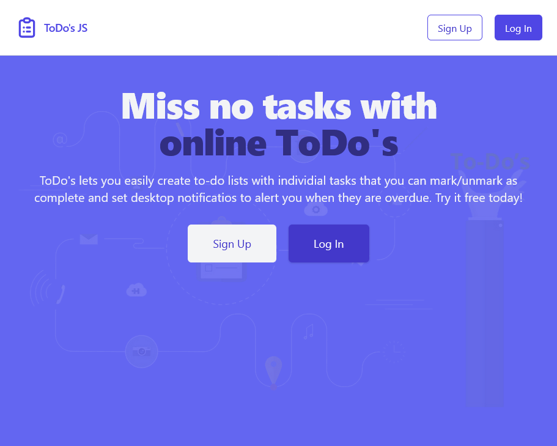

<p align="center">
  <a href="https://luvagu.github.io/todos-js-snowpack-tailwind/">
    
    <h1 align="center">ToDo's JS - Snowpack / Tailwind CSS / FaunaDB</h1>
  </a>
</p>

Serverless todo app build with Snowpack and Tailwind CSS. Auth and Data with FaunaDB

## Features

- Responsive design
- User Authentication with `FaunaDB's` built-in User authentication
- Fully integrated with `FaunaDB` for `CRUD` operations
- Saves `session` in the browser's `localstorage`
- Create Todo Lists
- Create Todo's Tasks
- Edit Task Name
- Prevents from creating duplicate Todo Lists names
- Add a `Desktop Notifications` per individual tasks (requires browser permission)
- Background `worker` automatically marks tasks as `complete` if overdue and triggers notifications

## Getting Started

> Clone and Install dev dependencies

```sh
git clone https://github.com/luvagu/todos-js-snowpack-tailwind.git

cd todos-js-snowpack-tailwind

npm install
```

> Find the project files in `src` & `public` directories

> Start the dev server

```sh
npm start
```

> Build the production app

> All the production ready files will be put in the `build` directory

```sh
npm run build
```

## FaunaDB Setup

- Create a free FaunaDB `Database` at https://fauna.com/
- Create a `Collection` called `users`
- Create a new `Index` called `users_by_email` with `Terms` containing `data.email` and `Unique` & `Serialized` selected
- Head to the `Security` tab and generate a `NEW KEY` **
- Copy the key and paste it where indicated below

** It's recommended to create a role with the appropriate permissions when exposing API key in the browser

```js
// src/fauna.helpers.js
// Replace YOUR_API_KEY with yours
const fClient = new faunadb.Client({ secret: 'YOUR_API_KEY' })
```

## Optional

> Deploy to GitHub Pages for Free

> Must first activate this option on your own repo and set the `homepage` link in your `package.json`

> Learn more at https://guides.github.com/features/pages/

```sh
npm run deploy
```

Try the demo account at: https://luvagu.github.io/todos-js-snowpack-tailwind

> Email: **demo@example.com** Password: **demo**

Enjoy!
